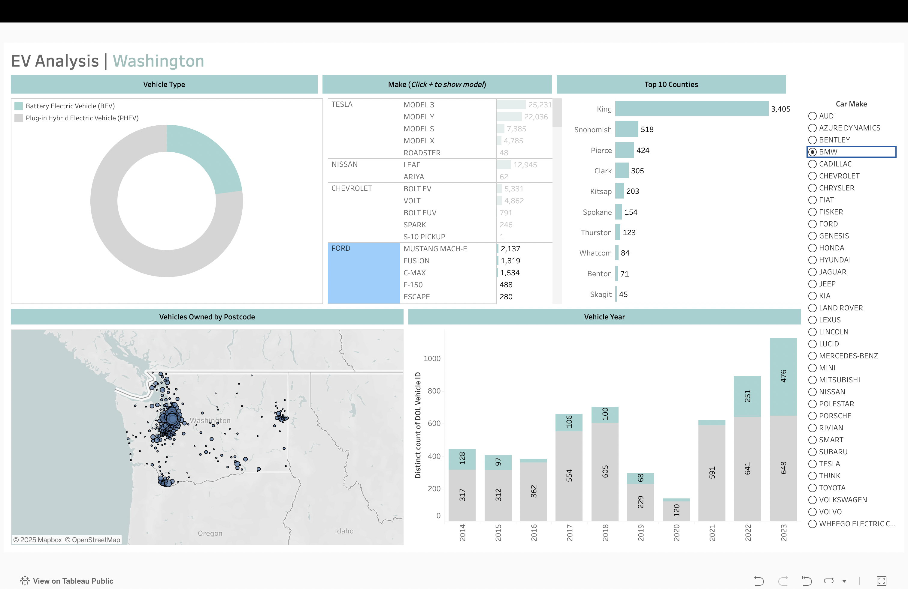
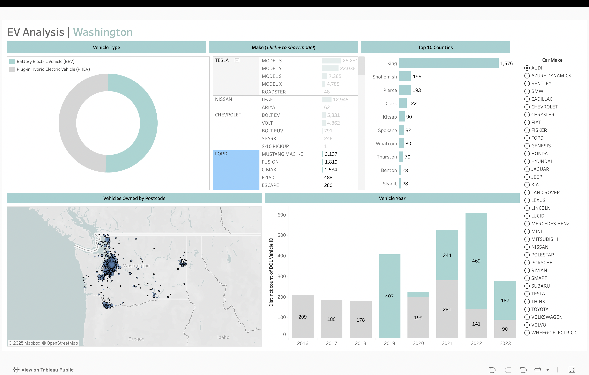

## Electric Vehicle Dashboard (Tableau)
This project contains a Tableau dashboard that visualizes electric vehicle ownership data in the state of Washington. The dashboard provides insights into EV types, makes and models, ownership distribution by geography, and vehicle registration trends over time.

## Live Version
View on Tableau Public
[View on Tableau Public](https://public.tableau.com/app/profile/shounak.sawant/viz/Book1_17545114778340/Dashboard1)

## Files
[Raw Data](Electric_Vehicle_Population_Data.xlsx)

## Preview
Previews of the Dashboard

 
 

## Dashboard Features
Vehicle Type breakdown (Battery Electric vs. Plug-in Hybrid)

Make & Model listings with counts 

Top 10 Counties with highest EV registrations

Vehicle Year distribution by Department of Licensing (DOL) ID

Geographical Map of EV ownership by postal code

## Tools Used
Tableau Desktop

Data Source: Washington State Department of Licensing (EV registrations)
